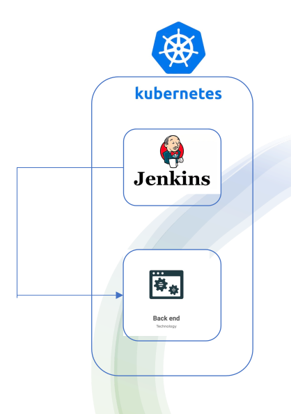

<header>
<h1 align="center">ITI-Graduation-Project</h1>

<h3 align="center">App</h23>
</header>


### **Requirements** 
• Deploy backend application on kubernetes cluster using CI/CD
jenkins pipeline using the following steps and high-level
diagram :
1. Implement secure Kubernetes cluster (infrastructure)
2. Deploy and configure Jenkins on Kubernetes. (infrastructure)
3. Deploy backend application on Kubernetes using Jenkins pipeline.

### **steps**
- Configure jenkins server
- Create jenkins pipeline
- Check the app


<p align="center">

</p>

#
## 1. Configure jenkins server


### 1. **Install plugins (kubernetes plugin)**


<p align="center">

</p>


### 2. **Create credentials**

- Github account
- dockerhub
<p align="center">

</p>


### 3. Configure the nodes

- Make built in node with label “master”

<p align="center">

</p>


- Create Kubernetes cloud node
    - Select namespace
    - jenkins tunnel

<p align="center">

</p>


## 2. Create jenkins pipeline

1. **Create dynamic pod with (docker in docker) image**
    
    ```bash
    pipeline {
        agent none 
          
        stages {
            stage('dynamic agent') {
                agent {
                    kubernetes {
                        yaml '''
                            apiVersion: v1
                            kind: Pod
                            spec:
                              containers:
                              - name: docker
                                image: docker:latest
                                command:
                                - cat
                                tty: true
                                volumeMounts:
                                 - mountPath: /var/run/docker.sock
                                   name: docker-sock
                              volumes:
                              - name: docker-sock
                                hostPath:
                                  path: /var/run/docker.sock
                            '''
                            }
                }
    ```
    

2. **Build the app image and push it to dockerhub with the dynamic agent**

```bash
steps {
      container('docker') {
          git 'https://github.com/Bassem-Kamel/ITI_gproject_app'
          sh "echo texsting ..........."
          withCredentials([usernamePassword(credentialsId: 'dockerhub', usernameVariable: 'USERNAME', passwordVariable: 'PASSWORD')]){
  
          sh "docker login -u ${USERNAME} -p ${PASSWORD}"
          sh "docker build ./node.js_app -t bassem22docker/myrepo:nodeapp"
          sh "docker push bassem22docker/myrepo:nodeapp"
  
      }
      }
```

3. **Use jenkins server to create app deployment**
    
    ```bash
    stage('App deployment on GKE') {
        agent {
            label 'master'
        }
        steps {
                git 'https://github.com/Bassem-Kamel/ITI_gproject_app'
                sh 'kubectl config view'
                sh 'gcloud container clusters get-credentials my-cluster1 --zone europe-west1-b --project iti-gproject'
                sh 'kubectl create -f app_deployment.yaml'
            }
    }
    ```
    
    ## 3. Check the app deployment
    
    1. **Get external ip of the loadbalancer**
    
    
    
    2. **Acces the app**
    
    